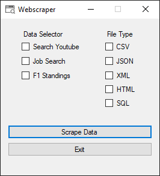
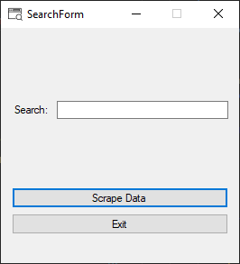
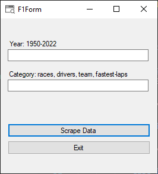

<h1>DevOpsWebScraperGui</h1>

# 1. Table Of Contents
- [1. Table Of Contents](#1-table-of-contents)
- [2. Introduction](#2-introduction)
- [3. Code](#3-code)
  - [3.1. Screens](#31-screens)
    - [3.1.1. Main screen](#311-main-screen)
    - [3.1.2. Search Screen](#312-search-screen)
    - [3.1.3. F1 Screen](#313-f1-screen)
  - [3.2. Scrapers](#32-scrapers)
    - [3.2.1. Dependencies](#321-dependencies)
    - [3.2.2. Youtube Search](#322-youtube-search)
    - [3.2.3. Search Job](#323-search-job)
    - [3.2.4. F1 Standings](#324-f1-standings)
  - [3.3. Exporters](#33-exporters)
    - [3.3.1. CSV](#331-csv)
    - [3.3.2. JSON](#332-json)
    - [3.3.3. XML](#333-xml)
    - [3.3.4. HTML](#334-html)
    - [3.3.5. SQL](#335-sql)
- [4. Conclusion](#4-conclusion)
- [5. Sources](#5-sources)

# 2. Introduction
This project is made for the DevOps & Security course on thomasmore geel. The goal is to make a console based webscraper application. This must be done with selenium browser automation tool and c#. The project description says that there need to be three scrapable websites: [youtube](https://www.youtube.com/), [ictjob](https://www.ictjob.be/) and a self chosen one. I chose for [F1 standings](https://www.formula1.com/en/results.html/2022/drivers.html). When the data is scraped from the web, it needs to be exported of course. It needed to be exportable to csv and json files, but I made the options to export to XML, HTML and sql.

# 3. Code
The project is build with two main classes: a class for the scraping part and a class for the export part. Besides that, there are 3 windows forms screens. A main screen and two scraper specific screens. You can find screenshots of the screens below. The windows forms screens where optional and a fun addition I added to the project.



## 3.1. Screens
The program was orriginally a console application, but when I noticed I had time enough to make some extra features, I copied the scraper and export classes and put them in a windows forms application. This Application is now much more easy to use. As mentioned earlier, there are three screens. One screen is the main screen where the application starts on. Then, depending on which data selector you choose, a different screen will pop up. For the search methods, the SearchForm is shown and for the F1 method the F1Form is shown. The three screens have identical measurements and the same layout. They all have the same application icon. To install the application, there is an installer in the releases in [the github repository](https://github.com/AnoniemeBeer/.)

### 3.1.1. Main screen
The main screen is the first screen the user gets to see. Here the user selects which of the following options he wants. If multiple options are given in a specific column, the top one will be used. When selecting scrape data, the needed screen is opened where the user has to input information. When the scraping is completed, the user will return to this screen and might choose another option or close the application.

### 3.1.2. Search Screen
This screen is the screen the user gets send to when he chooses for the 'Search youtube' or 'Job Search' option. On this screen, there is an input box where the user can give his searchterm he wants to search for on the webpage. When the scrape data button is clicked, the webscraper will start and a browser window will be opened and used by the script. When the scraping is finished, the user will be asked where he wants to store the scraped data. This happens with a windows save file screen. When the location is chosen, the file is saved and a last messagebox reminds the user of the absolute path of the newly generated file. The user is then send back to the main screen.

### 3.1.3. F1 Screen
The F1 screen looks the same as the search screen, but has two input boxes: one for the year and one for the category. The year must be an input between 1950 up to 2022(for now). The category must be one of the categories mentioned in the label of the input box. If any other information is entered, the program will give an error messagebox. When the information is correct and the button is clicked, the scraper will start gathering data from the website. After which it asks the user to specify the location where the data must be stored in the same way as for the search screen following with a messagebox with the absolute path. To round up the user is send back to the main screen

All the scripts that handle button clicks and user inputs can be found on the [github repository](https://github.com/AnoniemeBeer/DevOpsWebScraperGui).

## 3.2. Scrapers
The class is writen in the file: DataScraper.cs. It contains 5 methods, two of which are meant for development and testing. I will be focussing on the three methods used in the program. Communication between the data scrapers and the exporters are handled via a universal type. This is done by a two dimentional string list: List\<List\<string>>. This way, all scrapers can use all exporters and all exporters can convert data from all scrapers.

### 3.2.1. Dependencies
The project is build upon Selenium, a suite of tools for browser automation that allows developers to automate web browsers to test applications, scrape data, and perform various other tasks. This comes with a driver that connects to a browser window. To make this work, 2 dependencies are needed:
- Selenium webdriver: The driver selenium uses to connect to the browser
- WebDriver Manager: An automatic tool that lets selenium pick the right driver for whatever browser is installed on the system.
Also google chrome is needed for this project. The project is written to automatically connect to this browser.

### 3.2.2. Youtube Search
The youtube search method takes one parameter, the search term. The user can input this in on of the screens. It then puts the searchterm in the url that the selenium driver is connecting to. This way, the program doesn't have to first load youtube and then load youtube again with the searchterm in the search bar. This minimizes the amount of requests that happen to youtube servers. The first thing that the scraper will get from the driver or from the webpage is the 'accept all' button for the cookies. I tried to send cookies through the driver, but Youtube changes its cookies slightly constantly so that wasn't an option. The button is saved as a IWebElement and later clicked on.
Next, all videos on the webpage are stored in a array of IWebElements. This way, a foreach loop can be used to loop over all the videos and add their data to the list of string lists. I designed the lists in a way that the first item in the list is always a list of the names of the columns of the data. Those column names are hardcoded for the youtube searcher since those are not on the page itself. After that, the 5 latest released videos are extracted and added to the list. To finish the method, the driver is stopped and the final version of the list is returned.

```cs
public static List<List<string>> YoutubeSearch(string searchTerm)
{
    String urlSearch = "https://www.youtube.com/results?search_query={0}&sp=CAISAhAB";

    // Setting up the driver manager that automatically handles all drivers (drivers don't need to be installed)
    new DriverManager().SetUpDriver(new ChromeConfig());
    // Starting the google chrome driver
    IWebDriver driver = new ChromeDriver();

    // Navigating the chrome page to the desired link
    driver.Navigate().GoToUrl(String.Format(urlSearch, searchTerm.Replace(' ', '+')));

    System.Threading.Thread.Sleep(4000);

    //https://www.youtube.com/results?search_query=Rick+Astley&sp=CAISAhAB
    // Accept cookies
    try
    {
        IWebElement cookieButton = driver.FindElement(By.CssSelector("#content > div.body.style-scope.ytd-consent-bump-v2-lightbox > div.eom-buttons.style-scope.ytd-consent-bump-v2-lightbox > div:nth-child(1) > ytd-button-renderer:nth-child(2) > yt-button-shape > button"));
        cookieButton.Click();
        System.Threading.Thread.Sleep(4000);
    }
    finally { }

    // Get all videos from the page in a collection
    ReadOnlyCollection<IWebElement> videos = driver.FindElements(By.CssSelector("#contents > ytd-video-renderer"));

    // Create empty dicrionary list where all the videos will be added to.
    List<List<string>> videoData = new List<List<string>>();

    // Create an empty list where the starting data is going to
    List<string> headerList = new List<string>
    {
        "Title", "Url", "Uploader", "Views", "UploadDate"
    };
    videoData.Add(headerList);

    int max = 5;
    // Every video gets its own dictionary in the list
    for (int i = 0; i < 5; i++)
    {
        try
        {
            // Create an empty list where all data is going to
            List<string> list = new List<string>();

            // Defining the variable where the data will be stored in
            string str_videoTitle, str_videoUrl, str_uploader, str_views, str_uploadDate;

            // Getting the web elements from the from the page
            IWebElement elem_videoTitle = videos[i].FindElement(By.CssSelector("#video-title > yt-formatted-string"));
            IWebElement elem_videoUrl = videos[i].FindElement(By.CssSelector("#video-title"));
            IWebElement elem_uploader = videos[i].FindElement(By.XPath("div[1]/div/div[2]/ytd-channel-name/div/div/yt-formatted-string/a"));
            IWebElement elem_views = videos[i].FindElement(By.CssSelector("#metadata-line > span:nth-child(3)"));
            IWebElement elem_uploadDate = videos[i].FindElement(By.CssSelector("#metadata-line > span:nth-child(4)"));

            // Extracting the data from the web elements
            str_videoTitle = elem_videoTitle.Text;
            str_videoUrl = elem_videoUrl.GetAttribute("href");
            str_uploader = elem_uploader.Text;
            str_views = elem_views.Text;
            str_uploadDate = elem_uploadDate.Text;

            // Adding the extracted data to the dictionary.
            list.Add(str_videoTitle);
            list.Add(str_videoUrl);
            list.Add(str_uploader);
            list.Add(str_views);
            list.Add(str_uploadDate);

            videoData.Add(list);
        }
        catch { max++; }

    }

    driver.Quit();

    return videoData;
}
```

### 3.2.3. Search Job
This method is almost exactly the same as the youtube search method. It also has one parameter, it also inserts the search term in the url, it saves all jobs in a list, it adds the headers of the columns, .... The only big difference is that it has to sort the list of videos by date before extracting the video's. It also changes the search method to searching for all given words. Then finally it extracts all data from the jobs with one exception: some of the items in the jobs list aren't actual jobs but are advertisements. These are skipped in the loop by using a try statement. If the item is an ad, the driver will return an error because it cant find the title of the job and the loop will just skip that one and go one list item further to maintain the top five items.

```cs
public static List<List<string>> SearchJob(string searchTerm)
{
    String urlSearch = "https://www.ictjob.be/en/search-it-jobs?keywords={0}";

    // Setting up the driver manager that automatically handles all drivers(drivers don't need to be installed)
    new DriverManager().SetUpDriver(new ChromeConfig());
    // Starting the google chrome driver
    IWebDriver driver = new ChromeDriver();

    driver.Navigate().GoToUrl(String.Format(urlSearch, searchTerm.Replace(' ', '+')));
    System.Threading.Thread.Sleep(5000);

    //click the button to sort on date
    IWebElement dateButton = driver.FindElement(By.CssSelector("#sort-by-date"));
    dateButton.Click();
    System.Threading.Thread.Sleep(2500);

    // Click the button to change the search method
    IWebElement allWordsButton = driver.FindElement(By.XPath("//*[@id=\"column-keywords-options\"]/label[2]/span"));
    allWordsButton.Click();
    System.Threading.Thread.Sleep(10000);

    // Getting all the jobs in a list
    ReadOnlyCollection<IWebElement> jobs = driver.FindElements(By.CssSelector("#search-result-body > div > ul > li"));

    // Defining empty return list
    List<List<string>> jobData = new List<List<string>>();

    // Starting to fill the list with data.
    List<string> headerList = new List<string>
    {
        "JobTitle", "Company", "Location", "Keywords", "Url"
    };
    jobData.Add(headerList);

    int max = 5;

    for (int i = 0; i < max & i < jobs.Count; i++)
    {
        try
        {
            // Create an empty list where all data is going to
            List<string> list = new List<string>();

            // Defining the variable where the data will be stored in
            string str_jobTitle, str_company, str_location, str_keywords, str_url;

            // Getting the web elements from the from the page
            IWebElement elem_jobTitle = jobs[i].FindElement(By.CssSelector("span.job-info > a > h2"));
            IWebElement elem_company = jobs[i].FindElement(By.CssSelector("span.job-info > span.job-company"));
            IWebElement elem_location = jobs[i].FindElement(By.CssSelector("span.job-info > span.job-details > span.job-location > span > span"));
            IWebElement elem_keywords = jobs[i].FindElement(By.CssSelector("span.job-info > span.job-keywords"));
            IWebElement elem_url = jobs[i].FindElement(By.CssSelector("span.job-info > a"));

            // Extracting the data from the web elements
            str_jobTitle = elem_jobTitle.Text;
            str_company = elem_company.Text;
            str_location = elem_location.Text;
            str_keywords = elem_keywords.Text;
            str_url = elem_url.GetAttribute("href");

            // Adding the extracted data to the dictionary.
            list.Add(str_jobTitle);
            list.Add(str_company);
            list.Add(str_location);
            list.Add(str_keywords);
            list.Add(str_url);

            jobData.Add(list);
        }
        catch
        {
            max++;
        }

    }

    // Finishing up the method with quitting the driver and returning the data.
    driver.Quit();
    return jobData;
}
```

### 3.2.4. F1 Standings
For the last method in in this chapter, [the f1 standings website](https://www.formula1.com/en/results.html/2022/drivers.html) is scraped. On this website, you can find all driver champions, constructor champions, races from each year and fastest laps from each year from the start of F1 until now.
This method accepts two parameters. One for the category to display (race, driver, team and fastest lap) and one for the year from which the data must be pulled. This data will be inserted in the url. A cookies button is scraped and clicked as well. The data in this webpage is put in a html table. This makes it very easy to read. First, the names of the columns are extracted form the table header. Then, the data is read from the table row per row. To finish the method, the driver quits again and the list with data is returned.

```cs
public static List<List<string>> ScrapeF1Data(string categoryChoice, string yearChoice)
{
    string url = "https://www.formula1.com/en/results.html/{0}/{1}.html";

    // Setting up the driver manager that automatically handles all drivers(drivers don't need to be installed)
    new DriverManager().SetUpDriver(new ChromeConfig());
    // Starting the google chrome driver
    IWebDriver driver = new ChromeDriver();

    // This part of the code manages the driver and making usefull objects that store part of the webpage.
    driver.Navigate().GoToUrl(String.Format(url, yearChoice, categoryChoice));

    IWebElement acceptCookies = driver.FindElement(By.XPath("/html/body/div[5]/div/div/div[2]/div[3]/div[2]/button[2]"));
    acceptCookies.Click();

    IWebElement dataTable = driver.FindElement(By.CssSelector("body > div.site-wrapper > main > article > div > div.ResultArchiveContainer > div.resultsarchive-wrapper > div.resultsarchive-content > div > table"));

    List<List<string>> jobData = new List<List<string>>();

    ReadOnlyCollection<IWebElement> columnNames = dataTable.FindElements(By.CssSelector("thead > tr > th"));
    ReadOnlyCollection<IWebElement> columnData = dataTable.FindElements(By.CssSelector("tbody > tr"));

    // In this part of the code, the data form the table header is extracted from the page.
    List<string> headerList = new List<string>();
    foreach (IWebElement columnName in columnNames)
    {
        if (!columnName.GetAttribute("class").Equals("limiter"))
        {
            if (columnName.GetAttribute("class").Equals("header"))
            {
                headerList.Add(columnName.FindElement(By.TagName("abbr")).GetAttribute("title"));
            }
            else
            {
                headerList.Add(columnName.Text);
            }
        }
    }
    jobData.Add(headerList);

    // In this part of the code, the data will be extracted from the page and added to the list.
    foreach (IWebElement row in columnData)
    {
        List<string> list = new List<string>();
        ReadOnlyCollection<IWebElement> rowData = row.FindElements(By.CssSelector("td"));
        foreach (IWebElement data in rowData)
        {
            if (!data.GetAttribute("class").Equals("limiter"))
            {
                if (data.GetAttribute("class").Equals(""))
                {
                    if (data.FindElement(By.TagName("a")).Text.Equals(""))
                    {
                        string name = "";
                        ReadOnlyCollection<IWebElement> span = data.FindElement(By.TagName("a")).FindElements(By.TagName("span"));
                        for (int i = 0; i < 2; i++)
                        {
                            name += (span[i].Text);
                        }
                        list.Add(name);
                    }
                    else
                    {
                        list.Add(data.FindElement(By.TagName("a")).Text);
                    }
                }
                else
                {
                    list.Add(data.Text);
                }
            }
        }
        jobData.Add(list);
    }
    driver.Quit();
    return jobData;
}
```

All of the code can be found in the [github repository](https://github.com/AnoniemeBeer/DevOpsWebScraperGui) mentioned in the conclusion.

## 3.3. Exporters
When scraping for data, an important thing is how to store the data, because without a organized way of storing, the data becomes useless. This is why file types like csv, json and xml exist. The data enters the export methods inside the two dimentional string list mentioned earlier. All export methods have the same in and output, the 2D arrays as parameters and the paths the files are stored at as return values.

### 3.3.1. CSV
The csv method is very simple, it generates a string that contains all data stored in rows and columns and seperated with commas. When the string is generated, a save file screen is shown to the user. Here the user can select the location for the file and the file name. The type of the file is predefined as csv, however the user can choose to make it something else with the all files selection. Finally, a streamwriter object is generated and the string is writen to the file.

```cs
public static string WriteToCsv(List<List<string>> data)
{
    // In this part of the code the string with data is generated
    string csvString = "";
    foreach (List<string> entry in data)
    {
        string line = "";
        foreach (string s in entry)
        {
            line += s + ", ";
        }
        csvString+= line.Remove(line.Length - 2) + System.Environment.NewLine;
    }

    // In this part of the code, the data will be stored to the file
    SaveFileDialog saveFileDialog = new SaveFileDialog();
    saveFileDialog.Filter = "csv file (*.csv)|*.csv|All files (*.*)|*.*";
    string path = "";
    if (saveFileDialog.ShowDialog() == DialogResult.OK)
    {
        path = saveFileDialog.FileName;
        StreamWriter writer = new StreamWriter(path);
        writer.Write(csvString);
        writer.Close();
    }
    return path;
```

### 3.3.2. JSON

Json is a datatype that is often used in web environments: rest api's, databases, javascript config files, .... A json file exists of keys and values. A key is the name of the value. Multiple keys and values combined is an object. But, it can go further then that, multiple objects can be put together in an array. Keys are always surrounded by brackets, making it a string. Values can be string or integers. In this method only strings are used. The json string is made by intense string manipulation. The string is build layer per layer, or better said, line per line. In the end, the same process as the csv method is used to save the file and finish the method.

```cs
public static string WriteToJson(List<List<string>> data)
{
    // In this part of the code the string with data is generated
    List<string> jsonNames = data[0];

    string jsonString = "[" + System.Environment.NewLine;

    for (int j = 0; j < data.Count; j++)
    {
        if (data[j] != jsonNames)
        {
            string jsonDocument = "\t" + "{" + System.Environment.NewLine;
            for (int i = 0; i < data[j].Count; i++)
            {
                if (i == data[j].Count - 1)
                {
                    jsonDocument += "\t" + "\t" + '"' + jsonNames[i] + '"' + ":" + '"' + data[j][i].Replace('"', ' ') + '"' + System.Environment.NewLine;
                }
                else
                {
                    jsonDocument += "\t" + "\t" + '"' + jsonNames[i] + '"' + ":" + '"' + data[j][i].Replace('"', ' ') + '"' + "," + System.Environment.NewLine;
                }
            }
            if (j == data.Count - 1)
            {
                jsonDocument = jsonDocument.Remove(jsonDocument.Length - 1) + System.Environment.NewLine + "\t" + "}" + System.Environment.NewLine;
            }
            else
            {
                jsonDocument = jsonDocument.Remove(jsonDocument.Length - 1) + System.Environment.NewLine + "\t" + "}," + System.Environment.NewLine;
            }

            jsonString += jsonDocument;
        }
    }
    jsonString = jsonString.Remove(jsonString.Length - 1) + System.Environment.NewLine + "]";

    // In this part of the code, the data will be stored to the file
    SaveFileDialog saveFileDialog = new SaveFileDialog();
    saveFileDialog.Filter = "json file (*.json)|*.json|All files (*.*)|*.*";
    string path = "";
    if (saveFileDialog.ShowDialog() == DialogResult.OK)
    {
        path = saveFileDialog.FileName;
        StreamWriter writer = new StreamWriter(path);
        writer.Write(jsonString);
        writer.Close();
    }
    return path;
}
```

### 3.3.3. XML

Xml is another widely used datastorage file type. This file type works with tags. A tag carries the name thet represents the value. A tag looks like this: ```<City>Geel</City>```. The xml string itself is made in the same way as the other two: intensive string manipulation. To make the generation of the tags a little easier, there is a private method that does exactly that. The saving and finishing of the file and the method is, once again, the same as the other file types.

```cs
public static string WriteToXml(List<List<string>> data)
{
    // In this part of the code the string with data is generated
    List<string> xmlNames = data[0];

    string xmlString = "<?xml version=\"1.0\" encoding=\"UTF-8\" ?>" + System.Environment.NewLine;
    xmlString += XmlTag("Data") + System.Environment.NewLine;

    for (int j = 0; j < data.Count; j++)
    {
        if (data[j] != xmlNames)
        {
            string xmlDocument = "\t" + XmlTag("Data", false, j) + System.Environment.NewLine;
            for (int i = 0; i < data[j].Count; i++)
            {
                xmlDocument += "\t\t" + XmlTag(xmlNames[i]) + data[j][i] + XmlTag(xmlNames[i], true) + System.Environment.NewLine;
            }
            xmlDocument += "\t" + XmlTag("Data", true) + System.Environment.NewLine;

            xmlString += xmlDocument;
        }
    }
    xmlString += XmlTag("Data", true);

    // In this part of the code, the data will be stored to the file
    SaveFileDialog saveFileDialog = new SaveFileDialog();
    saveFileDialog.Filter = "xml file (*.xml)|*.xml|All files (*.*)|*.*";
    string path = "";
    if (saveFileDialog.ShowDialog() == DialogResult.OK)
    {
        path = saveFileDialog.FileName;
        StreamWriter writer = new StreamWriter(path);
        writer.Write(xmlString);
        writer.Close();
    }
    return path;
}
```

The xml tags are constructed in this very easy and straight forward method. It takes three parameters: the name of the tag, if it is an endtag and a possible id. I returns the tag as a string. This method is private, and thus can only be used inside the class. The method is made to be easilly callable inline when constructing strings.

```cs
        private static string XmlTag(string word, bool endTag = false, int id = -1)
        {
            if (endTag)
            {
                return "</" + word + ">";
            }
            else
            {
                if (id != -1)
                {
                    return "<" + word + " id=\"" + id + "\">";
                }
                return "<" + word + ">";
            }
        }
```

### 3.3.4. HTML

Html is basically the same as xml. It works with tags in the exact same way. However, since it has tags that can be displayed in a webbrowser, you could make a table from the data that can be opened in a browser. The method starts with creating the beginning of an html file. It also uses the xmlTag method to create the tags in an easy and readable way. The saving and finishing is the exact same as before.

```cs
public static string WriteToHtml(List<List<string>> data)
{ 
    // In this part of the code the string with data is generated
    List<string> tableHeaders = data[0];

    string xmlString = "<!DOCTYPE html>" + System.Environment.NewLine + xmlTag("html") + System.Environment.NewLine + xmlTag("head") + System.Environment.NewLine + "\t" + xmlTag("title") + "Scraped Data" + xmlTag("title", true) + System.Environment.NewLine + xmlTag("head", true) + System.Environment.NewLine + xmlTag("body") + System.Environment.NewLine;
    xmlString += "\t" + XmlTag("table") + System.Environment.NewLine;
    xmlString += "\t\t" + XmlTag("tr") + System.Environment.NewLine;
    for (int i = 0; i < tableHeaders.Count; i++)
    {
        xmlString += "\t\t\t" + XmlTag("th") + tableHeaders[i] + XmlTag("th", true) + System.Environment.NewLine;
    }
    xmlString += "\t\t" + XmlTag("tr", true) + System.Environment.NewLine;

    for (int j = 0; j < data.Count; j++)
    {
        if (data[j] != tableHeaders)
        {
            string xmlDocument = "\t\t" + XmlTag("tr", false) + System.Environment.NewLine;
            for (int i = 0; i < data[j].Count; i++)
            {
                xmlDocument += "\t\t\t" + XmlTag("td") + data[j][i] + XmlTag("td", true) + System.Environment.NewLine;
            }
            xmlDocument += "\t\t" + XmlTag("tr", true) + System.Environment.NewLine;

            xmlString += xmlDocument;
        }
    }
    xmlString += "\t" + XmlTag("table", true);
    xmlString += System.Environment.NewLine + xmlTag("body", true) + System.Environment.NewLine + xmlTag("html", true);

    // In this part of the code, the data will be stored to the file
    SaveFileDialog saveFileDialog = new SaveFileDialog();
    saveFileDialog.Filter = "html file (*.html)|*.html|All files (*.*)|*.*";
    string path = "";
    if (saveFileDialog.ShowDialog() == DialogResult.OK)
    {
        path = saveFileDialog.FileName;
        StreamWriter writer = new StreamWriter(path);
        writer.Write(xmlString);
        writer.Close();
    }
    return path;
}
```

### 3.3.5. SQL

It might be weird thinking about exporthing scraped data as sql files. What does it mean? In this case I interpreted it as generating queries that firstly: create the table, and secondly: fill the table with the data. This is, as everything is, done with string manipulation. The end of the method is the same as before.

```cs
public static string GenerateSql(List<List<string>> data)
{
    string sqlString = "CREATE TABLE Data(" + System.Environment.NewLine + "\tdataId int AUTO_INCREMENT PRIMARY KEY," + System.Environment.NewLine;
    List<string> sqlNames = data[0];

    // In this part of the code, the CREATE TABLE querry will be made
    foreach (string name in sqlNames)
    {
        sqlString += "\t" + name + " varchar(250)," + System.Environment.NewLine;
    }
    sqlString = sqlString.Remove(sqlString.Length - 2) + System.Environment.NewLine + ");" + System.Environment.NewLine;

    // In this part of the code, the insert querry will be made
    sqlString += "INSERT INTO Data(";
    foreach (string name in sqlNames)
    {
        sqlString += name + ", ";
    }
    sqlString = sqlString.Remove(sqlString.Length - 2) + ") VALUES" + System.Environment.NewLine;

    for (int i = 1; i < data.Count; i++)
    {
        sqlString += "\t(";
        foreach (string value in data[i])
        {
            sqlString += "\"" + value + "\"" + ", ";
        }
        sqlString = sqlString.Remove(sqlString.Length - 2) + ")," + System.Environment.NewLine;
    }
    sqlString = sqlString.Remove(sqlString.Length - 2) + ";";

    // In this part of the code, the data will be stored to the file
    SaveFileDialog saveFileDialog = new SaveFileDialog();
    saveFileDialog.Filter = "sql file (*.sql)|*.sql|All files (*.*)|*.*";
    string path = "";
    if (saveFileDialog.ShowDialog() == DialogResult.OK)
    {
        path = saveFileDialog.FileName;
        StreamWriter writer = new StreamWriter(path);
        writer.Write(sqlString);
        writer.Close();
    }
    return path;
}
```

# 4. Conclusion
The project was very fun to make. I enjoyed getting back into c#. I learned alot about how big companies design their site and I will take this knowledge and try to build better, more effecient websites.

The source code for the project can be found on [my github repository](https://github.com/AnoniemeBeer/DevOpsWebScraperGui). The installer to the project is located in the Releases tab in the latest release.

# 5. Sources

- [Selinum Webscraper](https://www.selenium.dev/documentation/)
- [Microsoft .net Documentation](https://learn.microsoft.com/en-us/dotnet/)
- [Stack Overflow c# section](https://stackoverflow.com/questions/tagged/c%23)
